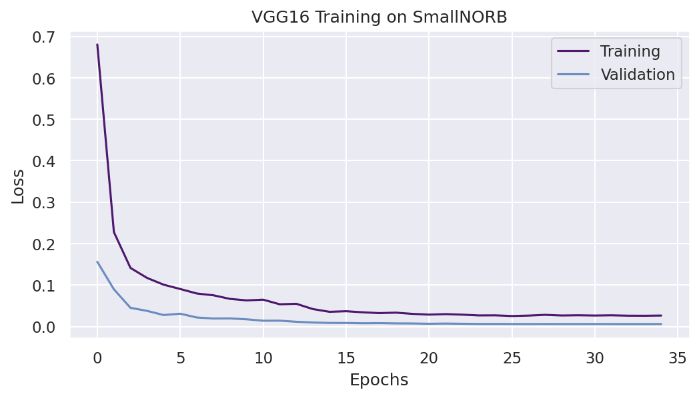

# Tightly Trained Architectures
Methodologies overview, used datasets and neural networks architectures.

## SmallNORB
* **Dataset Details**
    - Number of classes = 5
    - Train Size = 19,440
    - Train Augmentations
        - RandomResizedCrop(size=(224,224), scale=(0.8, 1.0))
        - RandomRotation(degrees=30)
        - RandomHorizontalFlip()
        - CenterCrop(size=64)
        - ToTensor()
        - Normalize(mean=0.485, std=0.229)
    - Validation Size = 4,860
    - Validation Augmentations:
        - Resize(size=(224, 224))
        - ToTensor()
        - Normalize(mean=0.485, std=0.229)
    - Test Size = 24,300
    - Test Augmentations:
        - Resize(size=(224, 224))
        - ToTensor()
        - Normalize(mean=0.485, std=0.229)

### VGG16
- Training Details
    - Trainable parameters = 1,050,757
    - Batch Size = 64
    - Epochs = 30
    - Initial Learning Rate = 1e-2
    - Momentum = 0.9
    - Weight Decay = 5e-4
    - Optimizer: SGD
    - Learning Rate Scheduler: ReduceLROnPlateau
    - Loss: Negative Log-Likelihood

- **Training Results**

- **Test Accuracy = 90.81%**

### Improved ResNet50
### SwinTransformer
### ConvNeXt
### ConvNeXt V2

## StreetsAndHouses

### VGG16
### Improved ResNet50
### SwinTransformer
### ConvNeXt
### ConvNeXt V2

